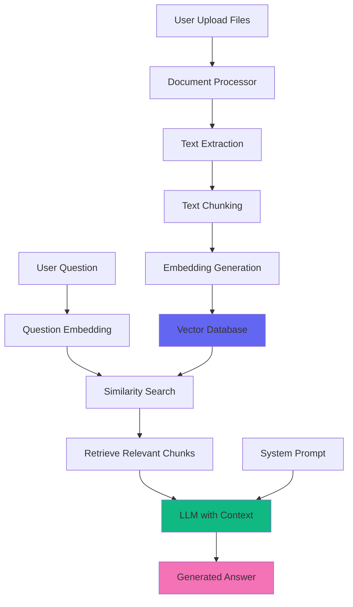

# RAG-Based Personal Assistant System

A personalized AI assistant that answers questions using your uploaded documents (PDFs, API specs, JSON files, etc.) combined with LLM intelligence.

---

## System Architecture



---

## Core Components

### 1. Document Processing Pipeline

**Supported Formats:**

- PDF files (API documentation, manuals, reports)
- JSON files (configuration, data schemas)
- Markdown files (notes, documentation)
- Text files (logs, code)
- CSV files (data tables)

**Processing Steps:**

1. **Extract text** from uploaded files
2. **Chunk text** into manageable pieces (500-1000 tokens)
3. **Generate embeddings** using OpenAI/Sentence Transformers
4. **Store in vector database** (ChromaDB, Pinecone, or Qdrant)

### 2. Vector Database Setup

**Options:**

- **ChromaDB** (local, free, easy to use)
- **Pinecone** (cloud, scalable, paid)
- **Qdrant** (open-source, fast, self-hosted)

**Data Structure:**

```json
{
  "id": "doc_123_chunk_5",
  "text": "The API endpoint /users accepts GET and POST requests...",
  "metadata": {
    "filename": "api_spec.pdf",
    "page": 12,
    "upload_date": "2025-12-21",
    "file_type": "pdf"
  },
  "embedding": [0.123, -0.456, ...]
}
```

### 3. Retrieval Process

When user asks a question:

1. **Convert question to embedding** using same model
2. **Search vector database** for top K most similar chunks (K=3-5)
3. **Retrieve chunks with metadata**
4. **Pass to LLM** as context

---

## System Prompt

```
You are a Personal AI Assistant with access to the user's uploaded knowledge base.

Your role is to:
1. Answer questions accurately using information from the user's documents
2. Cite specific sources when providing information (e.g., "According to api_spec.pdf, page 12...")
3. Be concise and actionable in your responses
4. If information is not found in the knowledge base, clearly state that

CRITICAL RULES:
- ALWAYS cite your sources when using information from documents
- If you're unsure or the information isn't in the knowledge base, say so
- Prioritize information from the user's documents over general knowledge
- Format code examples and technical information clearly

Available Knowledge Base:
{list_of_uploaded_files}

Response Format:
- Start with a direct answer
- Provide relevant details from the documents
- Include source citations in format: [Source: filename.pdf, page X]
- End with follow-up suggestions if applicable
```

---

## Implementation Guide

### Backend Stack

**Python + Flask/FastAPI:**

```python
# Required libraries
pip install langchain chromadb openai pypdf sentence-transformers flask

# Key files structure:
backend/
├── app.py                 # Main API
├── document_processor.py  # PDF/JSON parsing
├── vector_store.py        # ChromaDB operations
├── embeddings.py          # Generate embeddings
├── rag_chain.py           # RAG orchestration
└── uploads/               # Uploaded files storage
```

**Core Functions:**

```python
# 1. Upload and Process
@app.route("/upload", methods=["POST"])
def upload_document():
    """
    - Save uploaded file
    - Extract text (PyPDF2 for PDF, json.load for JSON)
    - Chunk text (500 tokens, 50 overlap)
    - Generate embeddings
    - Store in ChromaDB
    """
    pass

# 2. Ask Question with RAG
@app.route("/ask", methods=["POST"])
def ask_question():
    """
    - Get user question
    - Generate question embedding
    - Search ChromaDB for top 5 similar chunks
    - Build context from retrieved chunks
    - Call LLM with system prompt + context
    - Return answer with citations
    """
    pass

# 3. List Documents
@app.route("/documents", methods=["GET"])
def list_documents():
    """Return all uploaded documents with metadata"""
    pass

# 4. Delete Document
@app.route("/documents/<id>", methods=["DELETE"])
def delete_document(id):
    """Remove document and its embeddings from vector DB"""
    pass
```

---

## Sample Code

### Document Processing

```python
from langchain.document_loaders import PyPDFLoader, JSONLoader
from langchain.text_splitter import RecursiveCharacterTextSplitter
from langchain.embeddings import OpenAIEmbeddings
from langchain.vectorstores import Chroma

def process_pdf(file_path: str):
    """Process PDF and add to vector store."""
    # Load PDF
    loader = PyPDFLoader(file_path)
    documents = loader.load()

    # Split into chunks
    text_splitter = RecursiveCharacterTextSplitter(
        chunk_size=500,
        chunk_overlap=50,
        separators=["\n\n", "\n", " ", ""]
    )
    chunks = text_splitter.split_documents(documents)

    # Generate embeddings and store
    embeddings = OpenAIEmbeddings()
    vector_store = Chroma(
        collection_name="personal_docs",
        embedding_function=embeddings,
        persist_directory="./chroma_db"
    )
    vector_store.add_documents(chunks)

    return len(chunks)

def process_json(file_path: str):
    """Process JSON file."""
    with open(file_path) as f:
        data = json.load(f)

    # Convert JSON to text
    text = json.dumps(data, indent=2)

    # Create document
    doc = Document(
        page_content=text,
        metadata={"filename": file_path, "type": "json"}
    )

    # Add to vector store
    text_splitter = RecursiveCharacterTextSplitter(chunk_size=500)
    chunks = text_splitter.split_documents([doc])

    vector_store = Chroma(
        collection_name="personal_docs",
        embedding_function=OpenAIEmbeddings(),
        persist_directory="./chroma_db"
    )
    vector_store.add_documents(chunks)
```

### RAG Query

```python
from langchain.chains import RetrievalQA
from langchain.chat_models import ChatAnthropic

def answer_question(question: str) -> dict:
    """Answer question using RAG."""
    # Load vector store
    vector_store = Chroma(
        collection_name="personal_docs",
        embedding_function=OpenAIEmbeddings(),
        persist_directory="./chroma_db"
    )

    # Create retriever
    retriever = vector_store.as_retriever(
        search_type="similarity",
        search_kwargs={"k": 5}
    )

    # Create LLM
    llm = ChatAnthropic(model="claude-3-haiku-20240307")

    # Build RAG chain
    qa_chain = RetrievalQA.from_chain_type(
        llm=llm,
        chain_type="stuff",
        retriever=retriever,
        return_source_documents=True
    )

    # Get answer
    result = qa_chain({"query": question})

    # Format response with citations
    sources = []
    for doc in result["source_documents"]:
        sources.append({
            "filename": doc.metadata.get("filename"),
            "page": doc.metadata.get("page"),
            "content": doc.page_content[:100] + "..."
        })

    return {
        "answer": result["result"],
        "sources": sources
    }
```

---

## Frontend Features

### Upload Interface

```javascript
// File upload with drag-and-drop
async function uploadFile(file) {
  const formData = new FormData();
  formData.append("file", file);

  const response = await fetch("/api/upload", {
    method: "POST",
    body: formData,
  });

  const result = await response.json();
  console.log(`Processed ${result.chunks} chunks from ${file.name}`);
}
```

### Document Library

```html
<div class="document-library">
  <h2>Your Knowledge Base</h2>
  <div id="documents">
    <!-- List of uploaded documents -->
    <div class="document-card">
      <div class="doc-icon">📄</div>
      <div class="doc-info">
        <h3>api_specification.pdf</h3>
        <p>23 pages • Uploaded Dec 20, 2025</p>
        <span class="doc-chunks">115 chunks</span>
      </div>
      <button class="delete-btn">🗑️</button>
    </div>
  </div>
</div>
```

### Chat with Citations

```html
<div class="message bot-message">
  <div class="message-content">
    <p>
      According to your API specification, the /users endpoint supports both GET
      and POST methods.
    </p>

    <div class="citations">
      <h4>Sources:</h4>
      <div class="citation">
        📄 <strong>api_spec.pdf</strong> (page 12)
        <p class="citation-preview">
          "The API endpoint /users accepts GET requests for listing..."
        </p>
      </div>
    </div>
  </div>
</div>
```

---

## Advanced Features

### 1. **Semantic Search Filters**

```python
# Filter by document type
results = vector_store.similarity_search(
    query=question,
    k=5,
    filter={"file_type": "pdf"}
)

# Filter by date range
results = vector_store.similarity_search(
    query=question,
    k=5,
    filter={
        "upload_date": {"$gte": "2025-01-01"}
    }
)
```

### 2. **Multi-Query RAG**

Generate multiple query variations for better retrieval:

```python
from langchain.retrievers import MultiQueryRetriever

retriever = MultiQueryRetriever.from_llm(
    retriever=vector_store.as_retriever(),
    llm=ChatAnthropic()
)

# Automatically generates variations like:
# Original: "How do I authenticate?"
# Variations:
#   - "What is the authentication process?"
#   - "Explain authentication methods"
#   - "API authentication steps"
```

### 3. **Re-ranking**

Improve relevance with cross-encoder re-ranking:

```python
from sentence_transformers import CrossEncoder

# Get initial results
initial_results = vector_store.similarity_search(question, k=20)

# Re-rank with cross-encoder
reranker = CrossEncoder('cross-encoder/ms-marco-MiniLM-L-6-v2')
scores = reranker.predict([(question, doc.page_content) for doc in initial_results])

# Sort by score and take top 5
reranked = sorted(zip(initial_results, scores), key=lambda x: x[1], reverse=True)[:5]
```

### 4. **Streaming Responses with Citations**

```python
@app.route("/ask/stream", methods=["POST"])
def ask_stream():
    """Stream answer with real-time citations."""
    question = request.json["question"]

    # Retrieve context
    docs = retriever.get_relevant_documents(question)
    context = "\n\n".join([doc.page_content for doc in docs])

    # Stream response
    def generate():
        for chunk in llm.stream(build_prompt(question, context)):
            yield f"data: {json.dumps({'text': chunk})}\n\n"

        # Send citations after streaming
        citations = format_citations(docs)
        yield f"data: {json.dumps({'citations': citations, 'done': True})}\n\n"

    return Response(generate(), mimetype='text/event-stream')
```

---

## Security Considerations

1. **File Validation:**

   - Check file types (whitelist: pdf, json, txt, md, csv)
   - Limit file size (e.g., 10MB max)
   - Scan for malware

2. **User Isolation:**

   - Each user has separate vector collection
   - Documents tagged with user_id
   - Query filters by user_id

3. **Data Privacy:**
   - Encrypt files at rest
   - Use HTTPS for uploads
   - Clear embeddings when document deleted

---

## Example System Prompts

### For API Documentation Assistant

```
You are an API Documentation Assistant with access to the user's API specifications.

When answering questions:
1. Provide exact endpoint paths and methods
2. Show request/response examples from the docs
3. Cite page numbers for reference
4. Warn about deprecated endpoints if mentioned

Format responses as:
- Endpoint: GET /api/v1/users
- Parameters: [list with types]
- Example Response: [JSON block]
- Source: api_spec.pdf, page 15
```

### For Code Documentation Helper

```
You are a Code Documentation Helper with access to the user's codebase documentation.

When answering:
1. Provide code examples from the docs
2. Explain function signatures and parameters
3. Show related functions/classes
4. Include file paths and line numbers

Always format code in proper syntax highlighting blocks.
```

### For General Knowledge Assistant

```
You are a Personal Knowledge Assistant with access to the user's notes and documents.

Your personality:
- Friendly and conversational
- Concise but thorough
- Proactive with suggestions

When the user asks about their notes:
1. Summarize relevant information
2. Connect related concepts across documents
3. Suggest areas to explore further
4. Always cite specific documents
```

---

## Deployment Checklist

- [ ] Set up vector database (ChromaDB/Pinecone)
- [ ] Configure embedding model (OpenAI/SentenceTransformers)
- [ ] Implement file upload endpoint
- [ ] Add document processing pipeline
- [ ] Create RAG query endpoint
- [ ] Build frontend upload UI
- [ ] Add document management (list/delete)
- [ ] Implement citation display
- [ ] Add streaming responses
- [ ] Set up user authentication
- [ ] Configure file storage (S3/local)
- [ ] Add usage analytics
- [ ] Set up monitoring/logging
- [ ] Deploy to production

---

## Tech Stack Recommendation

**Backend:**

- Python 3.11+
- FastAPI or Flask
- LangChain for RAG orchestration
- ChromaDB (local) or Pinecone (cloud)
- OpenAI API for embeddings + LLM
- SQLite for metadata

**Frontend:**

- React or vanilla JS
- TailwindCSS for styling
- Drag-and-drop file upload
- Markdown rendering for responses

**Infrastructure:**

- Docker for containerization
- AWS S3 for file storage
- Vercel/Render for hosting
- PostgreSQL for production metadata

---

## Cost Estimation

**Per 1000 questions (with OpenAI):**

- Embeddings: ~$0.10 (text-embedding-3-small)
- LLM calls: ~$0.50 (GPT-3.5-turbo with context)
- Vector DB: Free (ChromaDB) or ~$0.05 (Pinecone)

**Total:** ~$0.65 per 1000 queries

**Optimization tips:**

- Use smaller embedding models (384d instead of 1536d)
- Cache common queries
- Use cheaper LLM for simple questions
- Implement query deduplication
